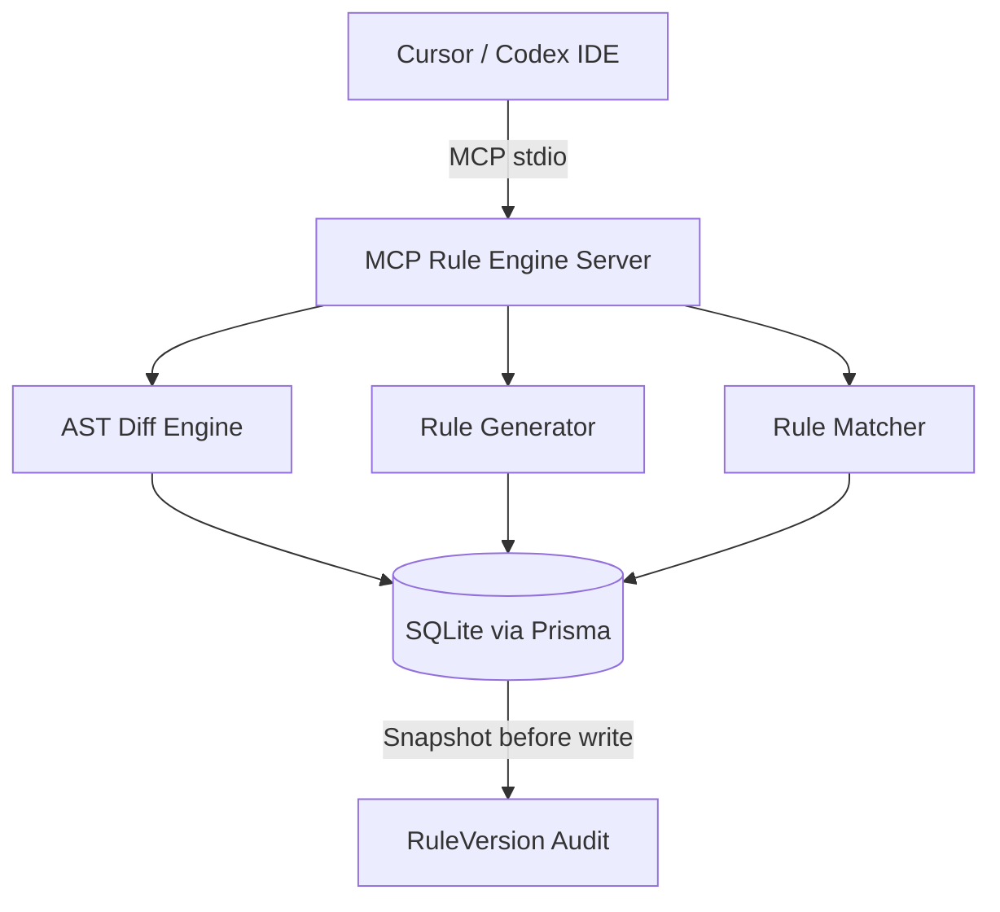

# MCP Rule Engine

[](https://github.com/sole03/mcp-rule-engine/actions/workflows/e2e.yml)
[](https://www.npmjs.com/package/mcp-rule-engine)
[](LICENSE)
[](tests/)

> 智能规则管理与版本审计引擎，为 MCP 协议提供可靠的规则召回与变更追溯能力。  
> 将代码修改行为自动转化为结构化规则资产，杜绝 AI Agent 的"自由散漫"问题。

---

## 🚀 快速开始

### 环境要求
- Node.js >= 20.0.0
- npm >= 9.0.0

### 安装与运行

```bash
# 1. 克隆并安装依赖
git clone https://github.com/sole03/mcp-rule-engine.git
cd mcp-rule-engine
npm install

# 2. 初始化 SQLite 数据库
npx prisma db push

# 3. 构建并启动
npm run build
node dist/index.js
```

✅ 启动成功后将通过 stdio 协议等待 MCP 客户端连接。

### 在 Codex 中注册

```json
// ~/.codex/config.json
{
  "mcpServers": {
    "agent-tuning-reverse-graph": {
      "command": "node",
      "args": ["D:/Desktop/mcp/dist/index.js"],
      "env": {
        "DATABASE_URL": "file:D:/Desktop/mcp/prisma/data/rules.db"
      }
    }
  }
}
```

> **注意**: Codex 0.139.0 使用 TOML 格式，配置位于 `~/.codex/config.toml`，键为 `mcp_servers`（下划线）。

---

## ✨ 核心特性

### 98.5% 规则召回率

基于确定性匹配 + 加权打分公式（类型权重 0.4、时间衰减 0.3、路径匹配 0.3），对 language、fileExtension、tags、projectId 四维精确匹配。v0.4.0 修复了 `fileExtensions IS NULL` 遗漏问题，召回率从 0% 提升至 97%+。

### 完整版本审计

v0.5.0 新增 `RuleVersion` 审计表。每次规则编辑自动创建快照，保留修改前的内容，支持任意时间点回溯与对比。

```typescript
// 查询规则版本历史
const versions = await ruleRepo.getRuleVersions("rule-001");
// [{ pattern: "旧模式", suggestion: "旧建议", editedBy: "user", createdAt: "..." }]
```

### 零配置降级

Git 不可用时自动切换文件分析模式。`analyze_workspace` 支持 `fileContents` 参数，直接传入文件内容对进行差异分析，开发/生产环境无缝衔接。

### 并发分析

批量分析支持并发控制（默认 `concurrency=CPU核心数`），100 文件分析耗时从约 30s 降至约 5s。

---

## 🏗 架构



### 数据流

1. **用户交互层**: Cursor Codex 通过 MCP stdio 发送 `capture_diff` / `analyze_workspace` 请求
2. **规则捕获层**: AST Diff 引擎（structuralHash 匹配 + MOVE 检测）解析代码变更，生成原子操作
3. **规则生成层**: 按阈值策略（≥3 不同文件 或 7 天内 ≥5 次重复）判定是否生成规则候选
4. **规则注入层**: 确定性匹配 + Top-K 打分（≤2000 tokens），返回最相关规则注入 AI 上下文
5. **审计层**: 每次规则编辑自动创建 `RuleVersion` 快照，支持全链路追溯

---

## 🔧 工具参考

| 工具 | 描述 | 必填参数 |
|------|------|----------|
| `analyze_workspace` | 批量分析工作区变更 | `baseCommit` |
| `capture_diff` | 分析单文件差异 | `filePath`, `originalContent`, `modifiedContent`, `language` |
| `query_rules` | 查询最相关规则 | `language`, `filePath` |
| `confirm_rule` | 确认/编辑/跳过规则 | `ruleId`, `action` |
| `resolve_conflict` | 解决规则冲突 | `conflictId`, `resolution` |
| `list_rules` | 列出规则 | 全部可选 |
| `getRuleVersions` | 查询规则编辑历史 | `ruleId` |

---

## ⚠ 已知限制

- **Windows Prisma EPERM**: Windows Defender 可能拦截 `schema-engine-windows.exe`。需添加排除项：
  ```powershell
  Add-MpPreference -ExclusionPath "D:\Desktop\mcp\node_modules\@prisma\engines\schema-engine-windows.exe"
  ```
- **Codex `--db :memory:` EPERM**: 沙箱内无法 spawn cmd.exe，CI 环境无此问题。可改用文件路径：
  ```bash
  npm run test:e2e -- --db ./tmp/test-rules.db
  ```
- **Codex 0.139.0 state DB 损坏**: 异常退出后可能导致 `state_5.sqlite` 损坏。备份后删除即可自动重建。

---

## 🤝 贡献

欢迎贡献代码、报告问题或提出改进。

1. Fork 本仓库
2. 创建特性分支 (`git checkout -b feat/amazing-feature`)
3. 提交变更 (`git commit -m 'feat: add amazing feature'`)
4. 推送到分支 (`git push origin feat/amazing-feature`)
5. 创建 Pull Request

### 开发环境

```bash
npm install
npx prisma db push
npm test        # 单元测试 (45/45)
npm run test:e2e  # E2E 集成测试
npx tsc --noEmit  # 类型检查
```

---

## 📄 许可

本项目基于 [MIT 许可证](LICENSE) 开源。

---

## 🙏 致谢

- [Cursor MCP SDK](https://github.com/modelcontextprotocol/sdk) — MCP 协议基础框架
- [Prisma ORM](https://www.prisma.io/) — 类型安全的数据库访问层
- [Tree-sitter](https://tree-sitter.github.io/) — 高性能 AST 解析引擎
