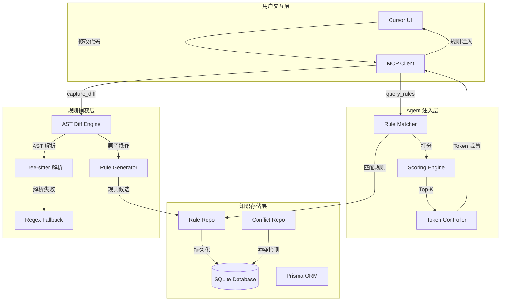

# Agent 调教反向图谱系统 — MCP Server

[](https://github.com/)
[](https://github.com/)
[](LICENSE)

## 概述

**Agent 调教反向图谱系统**是一个基于 [Model Context Protocol (MCP)](https://modelcontextprotocol.io) 的智能中间件，运行在 Cursor IDE 中。它将用户的代码修改行为自动转化为结构化的规则资产，实现 AI Agent 的无感调教。

无需手动编写提示词 —— 每次修改代码时，系统静默分析差异、提取模式、生成规则，并在未来的编码中自动注入相关规则，让 AI 越来越懂你的编码风格。

---

## 快速开始

```bash
cd D:\Desktop\mcp
npm install
npx prisma db push
npx tsc
node dist/index.js
```

> **注意**：首次运行前确保已创建 `.env` 文件，内容为 `DATABASE_URL="file:./data/rules.db"`。

---

## 系统架构

系统采用四层架构设计，形成从代码修改到规则注入的完整闭环：



### 层级职责

| 层级 | 职责 | 技术载体 |
|------|------|----------|
| **用户交互层** | 触发修改、确认规则、仲裁冲突 | Cursor UI + MCP Client |
| **规则捕获层** | 解析代码差异、提取原子操作、生成规则候选 | Tree-sitter + Node.js |
| **知识存储层** | 持久化规则、管理优先级、处理冲突 | SQLite + Prisma ORM |
| **Agent 注入层** | 相关性打分、Token 裁剪、Prompt 拼接 | MCP Server 内存 |

---

## Cursor MCP 配置

在 Cursor 的 MCP 配置文件（`~/.cursor/mcp.json`）中添加以下内容：

```json
{
  "mcpServers": {
    "agent-tuning-reverse-graph": {
      "command": "node",
      "args": ["D:\\Desktop\\mcp\\dist\\index.js"]
    }
  }
}
```

配置完成后重启 Cursor，在 Chat 或 Composer 中即可通过 Tool 调用与系统交互。

---

## Tool API 参考

系统通过 MCP Tool 协议暴露 5 个工具，所有交互基于 stdin/stdout 的 JSON-RPC 消息：

| 工具 | 描述 | 输入 | 输出 |
|------|------|------|------|
| `capture_diff` | 分析代码差异并生成规则候选 | `filePath`, `originalContent`, `modifiedContent`, `language` | `status`, `opCount`, `notification` |
| `query_rules` | 查询与当前上下文最相关的规则 | `language`, `filePath`, `tags` | `rules[]`, `totalTokens`, `truncated` |
| `confirm_rule` | 确认/拒绝/编辑/跳过规则候选 | `ruleId`, `action` | `success` |
| `resolve_conflict` | 解决规则冲突 | `conflictId`, `resolution` | `success`, `arbitrationCreated` |
| `list_rules` | 列出已有规则 | `language`, `scope`, `status` | `rules[]`, `total` |

### capture_diff

分析用户代码修改，通过 AST Diff 或正则降级提取原子操作，判断是否达到规则生成阈值。

- **输入参数**：`filePath`（文件路径）、`originalContent`（修改前内容）、`modifiedContent`（修改后内容）、`language`（编程语言）、`projectId`（可选，项目标识）
- **输出结果**：`status`（success/fallback/failed）、`opCount`（原子操作数）、`notification`（静默模式下学习新规则的通知）
- **模式行为**：在静默模式下自动学习规则；在确认模式下返回确认卡片供用户判断

### query_rules

基于当前编码上下文，从规则库中检索最相关的规则并按相关性降序返回。

- **输入参数**：`language`（编程语言）、`filePath`（当前文件路径）、`projectId`（可选）、`tags`（可选，标签过滤）
- **输出结果**：`rules[]`（规则列表，含分数和匹配原因）、`totalTokens`（总Token数）、`truncated`（是否被截断）
- **核心机制**：确定性匹配 + 加权打分，严格限制注入 Token ≤ 2000

### confirm_rule

对规则候选进行确认或拒绝操作，支持四种动作。

- **输入参数**：`ruleId`（规则ID）、`action`（accept/reject/edit/skip）、`editedPattern`（可选，编辑后的模式）、`editedSuggestion`（可选，编辑后的建议）
- **输出结果**：`success`（操作结果）

### resolve_conflict

当两条规则在相同作用域内互斥时，解决冲突。

- **输入参数**：`conflictId`（冲突ID）、`resolution`（keep_a/keep_b/merge/skip）、`batchAllSession`（可选，是否批量应用）
- **输出结果**：`success`（操作结果）、`arbitrationCreated`（是否生成了仲裁规则）

### list_rules

按条件查询规则列表，支持分页。

- **输入参数**：`language`（可选）、`scope`（可选，project/user/global）、`status`（可选，active/pending/archived）、`projectId`（可选）、`limit`（可选，默认50）、`offset`（可选）
- **输出结果**：`rules[]`（规则列表，含ID、类型、模式、建议、优先级等）、`total`（数量）

---

## 开发指南

### 脚本命令

| 命令 | 描述 |
|------|------|
| `npm test` | 运行所有测试（Vitest） |
| `npm run build` | 编译 TypeScript（tsc） |
| `npm run dev` | 开发模式，监听文件变更自动重启（tsx watch） |
| `npm run db:generate` | 重新生成 Prisma Client |
| `npm run db:push` | 将 Prisma Schema 推送到 SQLite 数据库 |

### 测试覆盖

系统包含 27 个单元测试，覆盖以下模块：

| 测试文件 | 测试数量 | 覆盖内容 |
|----------|----------|----------|
| `tests/engine/ast-diff.test.ts` | 7 | AST Diff 的 UPDATE/INSERT/DELETE 检测、空树处理、结构哈希匹配 |
| `tests/engine/rule-generator.test.ts` | 5 | 规则生成阈值判断、不同类型操作的置信度 |
| `tests/engine/rule-matcher.test.ts` | 6 | 语言匹配、时间衰减、Top-K 排序、匹配原因 |
| `tests/engine/token-controller.test.ts` | 4 | Token 估算、裁剪逻辑、空输入处理 |
| `tests/conflict/arbitrator.test.ts` | 5 | 冲突检测、解决策略、仲裁规则生成 |

### 添加新的语言解析器

系统默认使用基于行的基础 AST 解析器，并自动降级到正则匹配。如需支持特定语言的精确解析：

1. 在 `src/engine/parsers.ts` 中的 `parseToAST` 函数中添加语言分支
2. 实现对应语言的 AST 节点签名逻辑（参考 `src/engine/ast-node.ts`）
3. 添加测试用例到 `tests/engine/ast-diff.test.ts`
4. 运行 `npm test` 验证

### 技术指标

| 指标 | 目标值 |
|------|--------|
| 内存占用 | ≤ 300MB |
| query_rules P99 延迟 | ≤ 50ms |
| AST Diff 单次处理耗时（≤1000行） | ≤ 200ms |
| 单项目规则上限 | 2000 条 |
| 全局规则上限 | 3000 条 |
| 单条规则最大 Token | 100 |
| 注入上下文最大 Token | 2000 |

---

## 项目结构

```
D:\Desktop\mcp
├── prisma/
│   ├── schema.prisma          # Prisma 数据模型定义
│   └── data/
│       └── rules.db           # SQLite 数据库（运行时生成）
├── src/
│   ├── index.ts               # MCP Server 入口，Tool 注册与分发
│   ├── types.ts               # 全局类型定义与常量
│   ├── engine/
│   │   ├── ast-diff.ts        # AST 差异比较算法
│   │   ├── ast-node.ts        # AST 节点签名（Merkle树风格）
│   │   ├── parsers.ts         # AST 解析器入口，含降级逻辑
│   │   ├── regex-fallback.ts  # 正则降级差异比较
│   │   ├── rule-generator.ts  # 规则候选生成与阈值判断
│   │   ├── rule-matcher.ts    # 规则匹配与相关性打分
│   │   └── token-controller.ts# Token 估算与注入裁剪
│   ├── conflict/
│   │   └── arbitrator.ts      # 冲突检测与仲裁解决逻辑
│   ├── modes/
│   │   ├── silent.ts          # 静默模式处理流程
│   │   └── confirm.ts         # 确认模式处理流程
│   ├── storage/
│   │   ├── client.ts          # Prisma Client 单例管理
│   │   ├── rule-repo.ts       # 规则 CRUD 与查询
│   │   ├── diff-log-repo.ts   # 差异日志持久化
│   │   ├── conflict-repo.ts   # 冲突记录管理
│   │   └── metric-repo.ts     # 指标埋点
│   └── tools/
│       ├── capture-diff.ts    # capture_diff 工具处理
│       ├── query-rules.ts     # query_rules 工具处理
│       ├── confirm-rule.ts    # confirm_rule 工具处理
│       ├── resolve-conflict.ts# resolve_conflict 工具处理
│       └── list-rules.ts      # list_rules 工具处理
├── tests/
│   ├── engine/
│   │   ├── ast-diff.test.ts
│   │   ├── rule-generator.test.ts
│   │   ├── rule-matcher.test.ts
│   │   └── token-controller.test.ts
│   └── conflict/
│       └── arbitrator.test.ts
├── docs/
│   ├── api/
│   │   └── README.md          # API 详细文档
│   └── plans/
│       └── 2026-06-15-agent-tuning-reverse-graph.md
├── package.json
├── tsconfig.json
├── vitest.config.ts
├── .env                       # DATABASE_URL 配置
└── README.md
---

## License

MIT License. 详见 [LICENSE](LICENSE) 文件。
