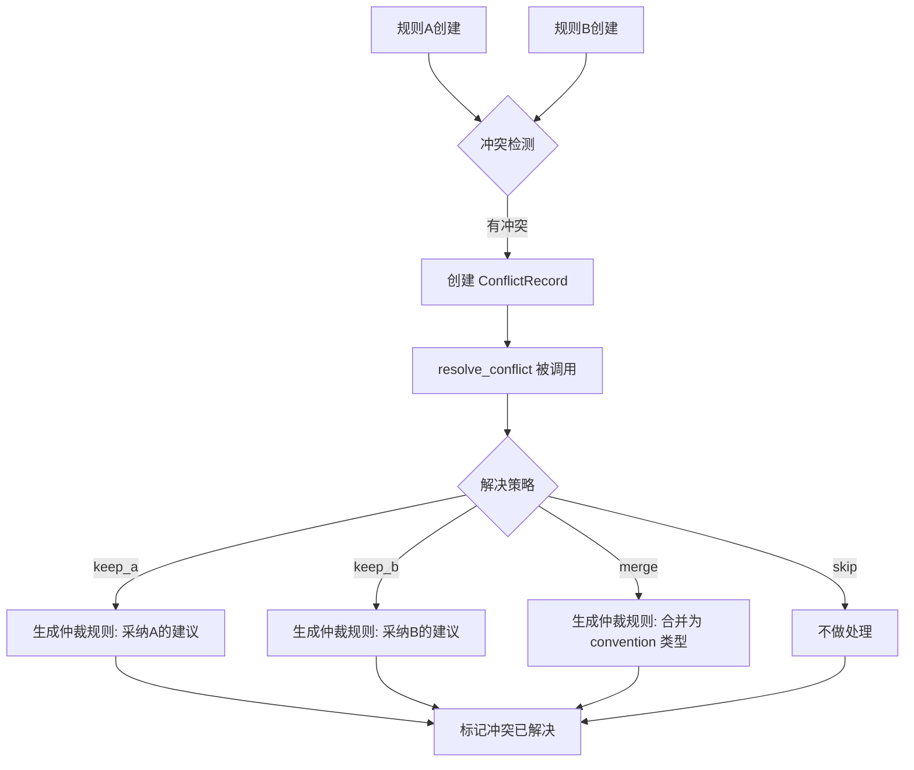

# API 参考文档

## 概述

系统作为 MCP Server 运行，通过 JSON-RPC 协议（基于 stdin/stdout）暴露 5 个工具。Cursor 的 MCP Client 自动处理协议层，开发者只需按标准 MCP Tool 规范调用即可。

---

## 完整工具参考

### capture_diff

分析代码差异并生成规则候选。

**输入参数 JSON Schema**：

```json
{
  "type": "object",
  "properties": {
    "filePath": {
      "type": "string",
      "description": "被修改文件的路径"
    },
    "originalContent": {
      "type": "string",
      "description": "修改前代码内容"
    },
    "modifiedContent": {
      "type": "string",
      "description": "修改后代码内容"
    },
    "language": {
      "type": "string",
      "description": "编程语言标识，如 typescript, python, go",
      "examples": ["typescript", "python", "go"]
    },
    "projectId": {
      "type": "string",
      "description": "项目标识（可选），用于区分不同项目的作用域",
      "optional": true
    }
  },
  "required": ["filePath", "originalContent", "modifiedContent", "language"]
}
```

**输出示例**：

```json
{
  "content": [
    {
      "type": "text",
      "text": "{\"status\":\"success\",\"opCount\":3,\"notification\":\"已学习新规则: replace — function\"}"
    }
  ]
}
```

**处理流程**：

1. 对 `originalContent` 和 `modifiedContent` 分别进行 AST 解析
2. 通过 `computeDiff` 比较两棵 AST 树，提取原子操作（UPDATE / INSERT / DELETE）
3. AST 解析失败或置信度过低时自动降级为正则匹配
4. 记录差异日志到 SQLite
5. 统计相同模式在不同文件中的出现次数和重复次数
6. 判断是否达到规则生成阈值（≥3 个不同文件 或 7 天内重复 ≥5 次）
7. 静默模式：满足阈值则自动生成规则；确认模式：返回确认卡片

---

### query_rules

查询与当前编码上下文最相关的规则。

**输入参数 JSON Schema**：

```json
{
  "type": "object",
  "properties": {
    "language": {
      "type": "string",
      "description": "当前文件的编程语言"
    },
    "filePath": {
      "type": "string",
      "description": "当前文件的路径"
    },
    "projectId": {
      "type": "string",
      "description": "项目标识（可选）",
      "optional": true
    },
    "tags": {
      "type": "array",
      "items": { "type": "string" },
      "description": "标签过滤（可选），如 [\"api\", \"react\"]"
    }
  },
  "required": ["language", "filePath"]
}
```

**输出示例**：

```json
{
  "content": [
    {
      "type": "text",
      "text": "{\"rules\":[{\"id\":\"uuid-xxx\",\"type\":\"replace\",\"pattern\":\"oldFn\",\"suggestion\":\"newFn\",\"score\":0.85,\"matchReasons\":[\"language_match\",\"path_match\"]}],\"totalTokens\":42,\"truncated\":false}"
    }
  ]
}
```

**查询流程**：

1. 从规则库中按 `language` + `fileExtension` + `tags` 过滤活跃规则
2. 对每条规则调用 `computeScore` 计算相关性得分
3. 按得分降序排序，取 Top-K（默认 10）
4. 通过 Token Controller 裁剪，确保总 Token ≤ 2000
5. 更新命中规则的 `matchCount` 和 `lastUsedAt`

---

### confirm_rule

对规则候选进行确认或拒绝操作。

**输入参数 JSON Schema**：

```json
{
  "type": "object",
  "properties": {
    "ruleId": {
      "type": "string",
      "description": "规则 ID（UUID）"
    },
    "action": {
      "type": "string",
      "enum": ["accept", "reject", "edit", "skip"],
      "description": "操作类型：accept=接受并激活，reject=拒绝并归档，edit=编辑后激活，skip=跳过暂不处理"
    },
    "editedPattern": {
      "type": "string",
      "description": "编辑后的模式内容（仅 action=edit 时生效）",
      "optional": true
    },
    "editedSuggestion": {
      "type": "string",
      "description": "编辑后的建议内容（仅 action=edit 时生效）",
      "optional": true
    }
  },
  "required": ["ruleId", "action"]
}
```

**输出示例**：

```json
{
  "content": [
    {
      "type": "text",
      "text": "{\"success\":true,\"ruleId\":\"uuid-xxx\",\"action\":\"accept\"}"
    }
  ]
}
```

**状态变更**：

| action | 规则状态变更 | 说明 |
|--------|-------------|------|
| accept | pending → active | 确认规则，后续查询将命中 |
| reject | pending → archived | 拒绝规则，标记归档 |
| edit | pending → active | 编辑后激活（需提供修改内容） |
| skip | 不变 | 暂不处理，规则保持 pending |

---

### resolve_conflict

解决规则冲突。

**输入参数 JSON Schema**：

```json
{
  "type": "object",
  "properties": {
    "conflictId": {
      "type": "string",
      "description": "冲突记录 ID（UUID）"
    },
    "resolution": {
      "type": "string",
      "enum": ["keep_a", "keep_b", "merge", "skip"],
      "description": "解决策略：keep_a=保留规则A，keep_b=保留规则B，merge=合并为新规则，skip=跳过"
    },
    "batchAllSession": {
      "type": "boolean",
      "description": "是否将此选择应用到本次会话的所有同类冲突",
      "optional": true
    }
  },
  "required": ["conflictId", "resolution"]
}
```

**输出示例**：

```json
{
  "content": [
    {
      "type": "text",
      "text": "{\"success\":true,\"resolution\":\"keep_a\",\"arbitrationCreated\":true}"
    }
  ]
}
```

---

### list_rules

列出规则。

**输入参数 JSON Schema**：

```json
{
  "type": "object",
  "properties": {
    "language": {
      "type": "string",
      "description": "按语言过滤（可选）"
    },
    "scope": {
      "type": "string",
      "enum": ["project", "user", "global"],
      "description": "按作用域过滤（可选）"
    },
    "status": {
      "type": "string",
      "enum": ["active", "pending", "archived"],
      "description": "按状态过滤（可选）"
    },
    "projectId": {
      "type": "string",
      "description": "按项目过滤（可选）"
    },
    "limit": {
      "type": "number",
      "description": "返回数量限制，默认 50",
      "optional": true
    },
    "offset": {
      "type": "number",
      "description": "分页偏移量",
      "optional": true
    }
  }
}
```

**输出示例**：

```json
{
  "content": [
    {
      "type": "text",
      "text": "{\"rules\":[{\"id\":\"uuid-xxx\",\"type\":\"replace\",\"pattern\":\"oldFn\",\"suggestion\":\"newFn\",\"language\":\"typescript\",\"scope\":\"project\",\"priority\":1.0,\"status\":\"active\",\"matchCount\":5,\"createdAt\":\"2026-06-15T...\"}],\"total\":1}"
    }
  ]
}
```

---

## 规则格式说明

### 规则字段

| 字段 | 类型 | 必填 | 描述 |
|------|------|------|------|
| `id` | string | 自动 | 规则唯一标识（UUID） |
| `type` | string | 是 | 规则类型：`replace`（替换）、`restructure`（重构）、`convention`（约定） |
| `pattern` | string | 是 | 匹配模式（原始代码文本） |
| `suggestion` | string | 是 | 建议替换内容（修改后代码文本） |
| `language` | string | 是 | 适用编程语言，`*` 表示所有语言 |
| `fileExtensions` | string[] | 否 | 适用文件扩展名列表，如 `["ts", "tsx"]` |
| `tags` | string[] | 否 | 标签，用于匹配和过滤 |
| `scope` | string | 否 | 作用域：`project`（项目级，默认）、`user`（用户级）、`global`（全局级） |
| `priority` | number | 自动 | 优先级（基于 scope 映射） |
| `confidence` | string | 自动 | 置信度：`high`、`medium`、`low` |
| `source` | string | 自动 | 来源：`auto`（自动生成）、`manual`（手动创建）、`arbitration`（仲裁生成） |
| `status` | string | 自动 | 状态：`active`（活跃）、`pending`（待确认）、`archived`（已归档） |
| `matchCount` | number | 自动 | 被查询命中的次数 |
| `createdAt` | datetime | 自动 | 创建时间 |
| `updatedAt` | datetime | 自动 | 最后更新时间 |
| `lastUsedAt` | datetime | 自动 | 最后命中时间 |

### 规则类型说明

| 类型 | 触发场景 | 示例 |
|------|----------|------|
| `replace` | 节点文本级替换（变量名、函数名、常量值等） | `foo` → `bar` |
| `restructure` | 节点结构重排（MOVE 操作主导） | 函数参数顺序调整 |
| `convention` | 编码约定和规范（通常从 merge 仲裁产生） | `// Alternative: ...` 注释标记 |

### 规则状态流转

```
[新建] → pending ──accept──→ active ──→ [可被查询命中]
                └──reject──→ archived
                └──skip────→ pending [保持等待]
                └──edit────→ active [编辑后激活]
```

---

## 冲突仲裁流程

### 冲突触发条件

两条规则同时满足以下条件时触发冲突检测：

1. 相同的 `type`
2. 相同的 `language`
3. 相同的 `pattern`（模式文本一致）
4. 不同的 `suggestion`（建议内容不一致）

### 仲裁流程



### 解决策略详解

| 策略 | 行为 | 仲裁规则 |
|------|------|----------|
| `keep_a` | 保留规则A的建议，继承规则B的标签 | 新规则，source=arbitration |
| `keep_b` | 保留规则B的建议，继承规则A的标签 | 新规则，source=arbitration |
| `merge` | 合并为 convention 类型规则 | 新规则，type=convention，confidence=medium |
| `skip` | 跳过，暂不处理 | 不生成新规则 |

### 批量处理

当 `batchAllSession=true` 时，系统记录当前会话的选择（`session:keep_a` 等），对本次会话中相同 `scopeKey` 的冲突自动应用相同策略。

---

## 评分公式说明

`query_rules` 使用确定性加权打分公式计算规则与当前上下文的匹配程度。

### 公式

$$Score = (W_{type} \times TypeValue) + (W_{time} \times e^{-\lambda \cdot \Delta t}) + (W_{match} \times MatchRatio)$$

### 参数

| 参数 | 默认值 | 说明 |
|------|--------|------|
| $W_{type}$ | 0.4 | 规则类型权重 |
| $W_{time}$ | 0.3 | 时间衰减权重 |
| $W_{match}$ | 0.3 | 路径/标签匹配权重 |
| $\lambda$ | 0.01 | 时间衰减系数（半衰期约 69 小时） |

### 计算因子

**类型值（$TypeValue$）**：

| 规则类型 | 值 |
|----------|-----|
| replace | 1.0 |
| restructure | 0.8 |
| convention | 0.6 |

**时间衰减（$e^{-\lambda \cdot \Delta t}$）**：

- $\Delta t$ 为规则创建到当前的小时数
- 新创建的规则得分更高
- 约 69 小时后衰减到 50%

**匹配比（$MatchRatio$）**：

- 检查规则标签是否命中当前文件路径（大小写不敏感）
- 检查请求的 `tags` 参数是否与规则标签重合
- $MatchRatio = \frac{命中数}{\max(命中数, 1)}$，即至少命中 1 个即为 1.0

**作用域优先级加成**：

| 作用域 | 加成系数 |
|--------|----------|
| project | × 1.0 |
| user | × 0.8 |
| global | × 0.5 |

最终得分乘以作用域优先级系数。

---

## 错误码参考

### 标准 MCP 错误

| 代码 | 名称 | 含义 |
|------|------|------|
| -32700 | Parse Error | JSON 解析失败 |
| -32600 | Invalid Request | 请求格式无效 |
| -32601 | Method Not Found | 调用的工具不存在 |
| -32602 | Invalid Params | 参数校验失败 |
| -32603 | Internal Error | 服务器内部错误 |

### 业务错误码（返回在 JSON body 中）

| 错误信息 | 触发条件 | 建议处理 |
|----------|----------|----------|
| `Rule not found` | confirm_rule 的 ruleId 不存在 | 检查 ruleId 是否正确 |
| `Conflict not found` | resolve_conflict 的 conflictId 不存在 | 检查 conflictId 是否正确 |
| `Referenced rule not found` | 冲突中引用的规则已被删除 | 重新检查规则状态 |

### 工具返回值参考

| 工具 | 成功标志 | 错误处理 |
|------|----------|----------|
| capture_diff | `content[0].text.status` 为 success/fallback/failed | failed 表示两次解析均失败，建议检查代码语法 |
| query_rules | 总是返回规则列表（可能为空） | 空列表表示无匹配规则 |
| confirm_rule | `isError: true` 且含 error 字段 | 检查 ruleId |
| resolve_conflict | `isError: true` 且含 error 字段 | 检查 conflictId |
| list_rules | 总是返回结果（可能为空） | 无异常情况 |

---

## Token 控制策略

### 限额

| 限制项 | 上限 |
|--------|------|
| 单次注入最大 Token | 2000 |
| 单条规则最大 Token | 100 |
| 单项目规则上限 | 2000 |
| 全局规则上限 | 3000 |

### Token 估算

Token 数 = `ceil(字节数 / 3.5)`

每条规则格式化为字符串后估算 Token，格式如下：

```
[replace] oldFn → newFn (files: ts, tsx) [api, utils] priority:1.0
```

### 截断逻辑

1. 规则按 Score 降序排列
2. 逐条检查 Token 是否在单条限制（100）内
3. 逐条累加到总 Token 预算（2000）
4. 超过预算时停止添加，标记 `truncated: true`
5. 未超过预算时标记 `truncated: false`
